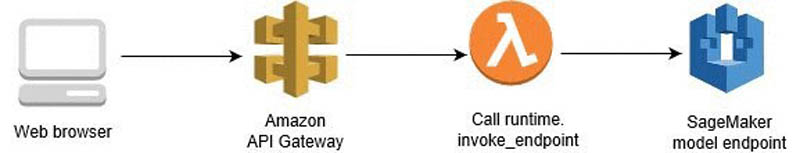
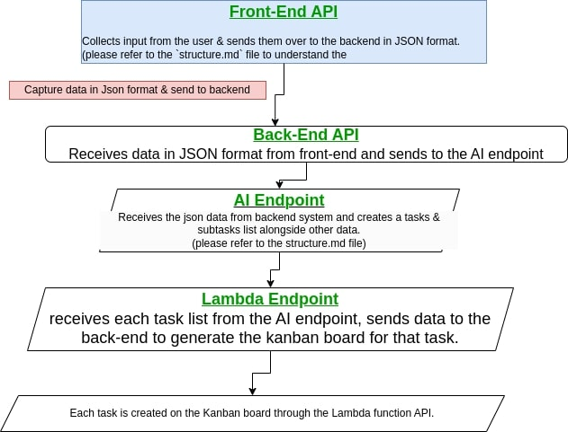

## Jira AI-planner (Atlassian Codegeist 2024)

This Jira extension uses AI to assist project managers, team leaders, or anyone in creating a base plan to begin working on their project idea by creating work items or tasks list on Jira. The output on Jira can easily be reviewed and modified to suit the project objectives. 

## How it works
Our project aims to save time and costs in project planning by using an AI solution that takes user inputs to generate a project plan on Kanban boards. These AI-driven features enhance productivity, efficiency, and decision-making within a software development team's Jira workflow, and the Jira AI planner can be customized to fit the product design.

### Inputs:
- Detailed description of the project you want to work on.
- Project timeline in weeks.

### Outputs:
- AI generated kanban board layouts with high-level tasks and sub-tasks required to achieve the project goals within the specified timeline.
- AI generated deliverables and success criteria for the project.
- AI detailed steps and milestones for the project.

## Developer refs
- To accelerate development & save time, we used a pre-built AI solution (AWS Sagemaker).
- Structure flow (Frontend -> API Gateway -> AWS Lambda -> SageMaker endpoint)

### Notes
## intended flow structure
